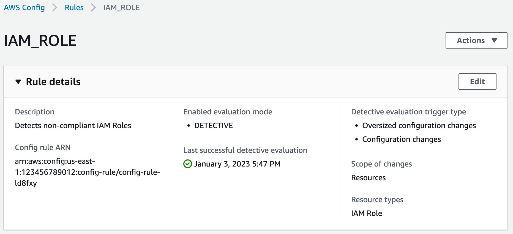
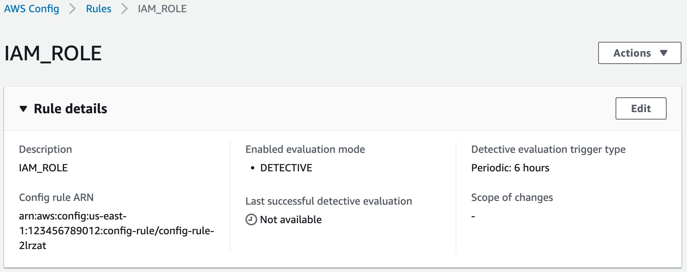
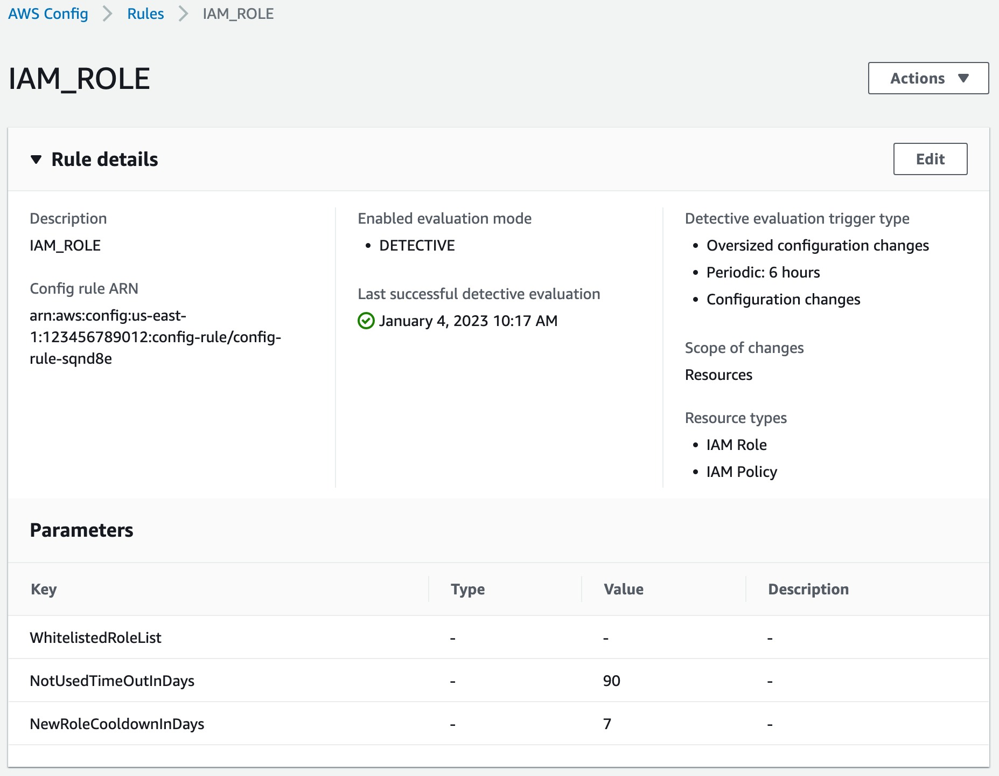

# Creating RDK rules

Below, we are going to explain metadata fields and how you can set them using RDK.
With RDK installed, all you need to do to create a new custom rule is to run the rdk create command with the required parameters. Answering the following questions will help you to provide the right arguments to rdk create:

- What is the resource type(s) you want to evaluate?
- What should trigger the rule execution (e.g., configuration changes, periodic, hybrid)?
- What are the parameters that should be passed to the Lambda function?

## Creating rules with rdk create command

`rdk create` has many possible arguments, which include rule metadata arguments and remediation arguments (remediation arguments are covered in a later section in this guide).
You can see the full list of commands by running the command `rdk create --help`.
The following table includes AWS Config rule’s metadata fields and its corresponding `rdk create` options:

| Config Metadata Field | `rdk create` option |
| --------------------- | ------------------- |
|_identifier_: ID for an AWS managed rule (written in all caps with underscores)| the first argument after `rdk create` is the rule name of your choice: `rdk create <RULE_NAME>` |
| _defaultName_: the name that instances of a rule will get by default. | rdk uses rule identifier as the defaultName. |
| _description_: provides context for what the rule evaluates. | `rdk create` does not accept an option for rule description and uses rule name/identifier. This can be modified manually by updating the parameters.json file. |
| _scope_: resource types targeted by the rule. | use `-r, --resource-types` with `rdk create` to specify resource types that trigger the rule (single resource or a comma delimited list of resources). |
| _sourceDetails_: rule's trigger type when detective evaluation occurs: `ConfigurationItemChangeNotification`, `OversizedConfigurationItemChangeNotification`, and `ScheduleNotification`. | When creating a rule with rdk, you don’t explicitly select rule trigger type, rather it is set when you use `-r, --resource-types` and/or `-m, --maximum-frequency` options. More on this in the following sections. |
| _compulsoryInputParameterDetails_: rule’s required parameters. | use `-i, --input-parameters` with `rdk create` to specify required parameters. Accepts JSON format inputs, for example `"{\"desiredInstanceType\":\"t2.micro\"}"` |
| _optionalInputParameterDetails_: parameters that are optional for a rule to do its evaluation. | use `--optional-parameters` with `rdk create` to specify optional parameters. Accepts JSON format inputs. |
| _labels_: used to optionally tag rules. | use `--tags` with `rdk create` to specify rule tags. Accepts JSON format input. |
| _supportedEvaluationModes_: could be `DETECTIVE` or `PROACTIVE`. We only cover detective rules in this guide. | rdk doesn’t support setting evaluation mode and will default to `DETECTIVE`. |

The only argument required by `rdk create` is `<rulename>` which is a positional argument. In addition, one of either `-r , --resource-types` or `-m , --maximum-frequency` is required to indicate the type of rule to create. So, in its simplest form, you can create your first rule by running:
`rdk create <rule_name> -r <resource_type>`
By running the `rdk create` command, RDK creates a new directory with several files, including a skeleton of your Lambda code. RDK creates three files in a directory named after your rule:

- _<rule_name>.py_: skeleton of your Lambda code
- _<rule_name>_test.py_: unit test framework for your rule
- _parameters.json_: holds rule metadata

Table below lists parameters (rule metadata) included in parameters.json file for different type of rules and how they map to `rdk create` arguments.

| Parameter | Description | Rule type | rdk create argument |
| --------- | ----------- | --------- | ------------------- |
| RuleName | Rule name | All | positional argument |
| Description | Rule description | All | Same as rule name by default |
| SourceRuntime | Lambda function runtime | All | `--runtime` |
| CodeKey | Name of zip file uploaded by RDK | All | N/A |
| InputParameters | Rule input parameters (JSON format) | Optional for all | `--input-parameters` |
| OptionalParameters | Rule optional parameters (JSON format) | Optional for all | `--optional-parameters` |
| SourceEvents | Resource type(s) | Configuration change/Hybrid | `--resource-types` |
| SourcePeriodic | Evaluation frequency | Periodic/Hybrid  | `--maximum-frequency` |

Once you have your rule created, you should write your Lambda code and incorporate your compliance evaluation logic. We will cover the Lambda function in the next section.

## Examples

### Creating a configuration change triggered rule to assess IAM roles’ compliance

Run `rdk create IAM_ROLE --runtime python3.11 --resource-types AWS::IAM::Role`. This command creates a folder named IAM_ROLE in your working directory containing rule files.

When you use `--resource-types or -r` options, you are implicitly setting your rule’s trigger type to configuration changes, so when you deploy this rule, you will see Oversized configuration changes and Configuration changes under Detective evaluation trigger type in your rule’s detail page on AWS Config console:

### Creating a periodically triggered rule to assess IAM roles’ compliance

Run `rdk create IAM_ROLE --runtime python3.11 --maximum-frequency Six_Hours`. Using the `-m, or --maximum-frequency` option, implicitly sets your rule’s trigger type to periodic, so when you deploy this rule, you will see Periodic: 6 hours under Detective evaluation trigger type in your rule’s detail page on AWS Config console:

Note that _Scope of Changes_ is empty because this is a periodically triggered role.

### Creating a hybrid rule with input parameters to assess multiple resource types’ compliance

You can create rules that use EITHER `resource-types` OR `maximum-frequency` options, but not both. We have found that rules that try to be both event-triggered as well as periodic wind up being very complicated and so we do not recommend it as a best practice.

However, it is possible to create rules with hybrid trigger type, you just need to make sure that hybrid trigger type rule is absolutely required to meet your compliance criteria. [Here](https://github.com/awslabs/aws-config-rules/tree/master/python/IAM_USER_USED_LAST_90_DAYS) is an example of hybrid trigger type rule.

Run `rdk create IAM_ROLE --runtime python3.11 --maximum-frequency Six_Hours --resource-types AWS::IAM::Role,AWS::IAM::Policy --input-parameters "{\"WhitelistedRoleList\": \"\", \"NotUsedTimeOutInDays\": \"90\", \"NewRoleCooldownInDays\": \"7\"}"`. This command creates a role which is triggered by both configuration changes and periodically. It also takes three input parameters, where `NotUsedTimeOutInDays` and `NewRoleCooldownInDays` have default values of 90 and 7. You can specify `--optional-parameters` using the same format used here for `--input-parameters`. On Windows it is necessary to escape the double-quotes when specifying input parameters, otherwise you don’t need to escape them.

This rule is triggered every six hours, and every time there is a change in _AWS::IAM::Role_ or _AWS::IAM::Policy_ resource types. When you deploy this rule you will see _Oversized configuration changes, Periodic: 6 hours_ and _Configuration changes_ under _Detective evaluation trigger type_ in your rule’s detail page on AWS Config console, you should also see two different resource types under _Resource types_:

