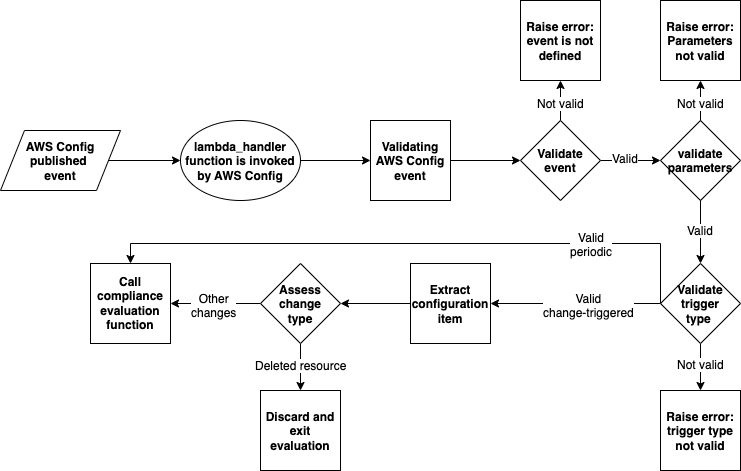
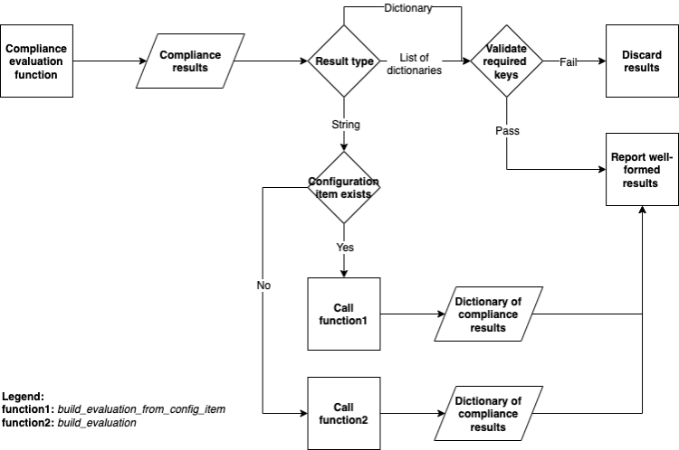

# Introduction

When an AWS Config rule is triggered, AWS Config invokes the rule’s Lambda function, passing the triggering event as an argument to the Lambda function. An AWS Lambda event is a JSON-formatted document containing data for the Lambda function to operate. Visit [Example Events for AWS Config Rules](https://docs.aws.amazon.com/config/latest/developerguide/evaluate-config_develop-rules_example-events.html) for more information.

## Lambda function’s logic

An AWS Config rule’s Lambda function includes a lambda_handler function that takes the event published by the AWS Config service, and assesses the associated resource’s compliance. You might notice _context_ as the second argument for the lambda_handler function, in newer versions of Lambda, this argument is no longer needed.

The lambda_handler function, performs two major tasks:

- Validating published event by AWS Config and evaluating resource(s) compliance
- Validating compliance results, and reporting back to AWS Config

### Validating published event by AWS Config and evaluate resource(s) compliance

Here are the highlights of what the lambda_handler function does:

- Invokes check_defined function to make sure the event is passed to lambda_handler function is not empty.
- Runs `invoking_event = json.loads(event["invokingEvent"])` to extract invoking event element of the event and stores is invoking_event variable.
- Checks to see if there are any rule parameters in the event, and stores them in rule_parameters variable.
- Invokes evaluate_parameters function to check input parameters are valid. If you have input parameters, you need to modify evaluate_parameters to do input sanitization and validation.
- If the input parameters are valid, it checks rule’s trigger type by extracting `invoking_event["messageType"]` and comparing it against one of the possible trigger types:
  - `"ConfigurationItemChangeNotification"`
  - `"ScheduledNotification"`
  - `"OversizedConfigurationItemChangeNotification"`
- If the rule trigger type is valid, it runs the get_configuration_item function:
  - A configuration item represents a point-in-time view of the various attributes of a supported AWS resource that exists in your account. learn more here.
  - For change-triggered rules it extracts the configuration item from invoking event
  - For periodic rules it returns `None`
  - For invalid message types (trigger types) it returns an _"Unexpected message type"_ error.
- Finally, it invokes the is_applicable function to discard events triggered by a deleted resource, for all other events, it calls the evaluate_compliance function to do compliance evaluation

### Validating compliance results, and reporting back to AWS Config

When you create your AWS Config rule files using `rdk create` command, your Lambda function file has an empty evaluate_compliance function which you need to populate with your compliance evaluation logic and return the compliance result (see the [Writing an evaluate_compliance function](writing-an-evaluate_compliance-function.md) for guidance on updating this function). Compliance results is expected to be a string, a dictionary or a list of dictionaries containing the following keys:

- `ComplianceResourceType`
- `ComplianceResourceId`
- `ComplianceType`
- `OrderingTimestamp`

The Lambda skeleton file includes following helper functions to create compliance result dictionaries:

- build_evaluation function, generally used for periodically triggered rules, returns a compliance result dictionary and accepts the following arguments:
  - `resource_id`
  - `compliance_type`: can be `COMPLIANT`, `NON_COMPLIANT`, or `NOT_APPLICABLE`
  - event
  - `resource_type=DEFAULT_RESOURCE_TYPE`, you can set `DEFAULT_RESOURCE_TYPE` variable (defaults to `'AWS::::Account'`) in the skeleton file and avoid passing it every time if your rule is scoped only to one type of resource
  - `annotation=None` You can pass an annotation string providing more information about compliance status of the resource being assessed. Annotations are shown in the AWS Config console or response of AWS CLI or AWS SDK calls.
- build_evaluation_from_config_item function, generally used for configuration change triggered rules, returns a compliance result dictionary and accepts the following arguments:
  - `configuration_item`: for configuration-change-based rules, the configuration item describing the resource that changed state.
  - `compliance_type`: a string with the evaluated compliance status, one of `COMPLIANT`, `NON_COMPLIANT`, or `NOT_APPLICABLE`
  - `annotation=None`: an optional string providing more information about compliance status of the resource being assessed. Annotations are shown on AWS Config console or response of AWS CLI or AWS SDK calls. These are particularly recommended for `NON_COMPLIANT` resources to explain why a resource is non-compliant.

The returned value from the evaluate_compliance function is stored in `compliance_result` variable.

Once the compliance results are returned, lambda_handler follows the below logic:

- If `compliance_result` variable is empty, the results are recorded as NOT_APPLICABLE.
- If `compliance_result` variable is list type with dictionary elements, lambda_handler checks to see if all the required keys are i- luded with each member, and upon successful verification it reports the results of evaluation.
- If `compliance_result` variable is dictionary type, lambda_handler checks to see if all the required keys are included, and upon successful verification it reports the results of evaluation.
- If `compliance_result` variable is string type, lambda_handler calls:
  - build_evaluation_from_config_item function, if configuration_item exists and converts `compliance_result` to a dictionary and reports the results of evaluation.
  - build_evaluation function if configuration_item does not exist and converts `compliance_result` to a dictionary and reports the results of evaluation.

The rest of the Lambda function, takes care of error handling, and should not be modified.
